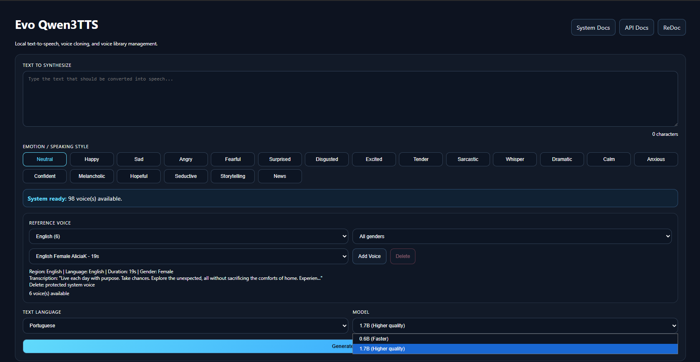

# Evo Qwen3TTS for Windows

Local text-to-speech system with voice cloning, Whisper transcription, FastAPI docs, and a browser UI.



## Overview

Evo Qwen3TTS is a local Windows-first application for generating speech from text using local Qwen3TTS model folders and reference `.wav` voices. It includes:

- browser interface
- FastAPI backend
- interactive API docs
- automatic reference voice transcription with Whisper
- voice upload and deletion for custom voices
- background startup transcription with live UI status
- multiple speaking styles and emotions

## Main URLs

- App UI: `http://localhost:5050`
- System docs: `http://localhost:5050/docs.html`
- Swagger / FastAPI docs: `http://localhost:5050/api-docs`
- ReDoc: `http://localhost:5050/api-redoc`

## Key Concept

`voice` and `language` are different:

- `voice` defines the speaker timbre or cloned voice identity
- `language` defines the language of the text you typed, which affects pronunciation

Recommended usage:

- Portuguese text -> use `language: "portuguese"`
- English text -> use `language: "english"`
- Match the voice language to the text language unless you intentionally want a mixed timbre/pronunciation setup

## Minimum System Requirements

These are practical minimums for running the project locally with CUDA:

- Windows 10 or Windows 11
- NVIDIA GPU with CUDA support
- Recent NVIDIA drivers installed
- Python 3.11 if you do not want to use the portable Python path
- 16 GB RAM recommended
- SSD recommended
- At least 20 GB free disk space recommended for environment, dependencies, temporary files, and model storage

GPU guidance:

- `0.6B` model: lower VRAM requirement, better for lighter systems
- `1.7B` model: more VRAM required, better quality but heavier

Practical recommendation:

- minimum usable: modern NVIDIA GPU with at least 8 GB VRAM
- better experience: 12 GB VRAM or more

## Repository Structure

Root:

- `start.bat`: launch the application
- `install.bat`: install and validate requirements
- `README.md`: GitHub landing page
- `image.png`: main screenshot used by this README
- `.gitignore`: ignore rules for local and large files

Application files:

- `app/api.py`: FastAPI backend
- `app/index.html`: main browser UI
- `app/docs.html`: HTML manual
- `app/README.md`: compact app notes
- `app/requirements.txt`: Python dependencies
- `app/generate.py`: helper script

Local runtime folders:

- `models/`: local model folders, not committed
- `reference_audio/`: local voice files
- `output/`: generated audio files

## Installation

Run:

```bat
install.bat
```

What `install.bat` does:

1. Verifies required project files exist
2. Checks for portable Python, virtual environment Python, or system Python
3. Installs portable Python if Python is missing
4. Checks NVIDIA GPU / CUDA availability
5. Checks ffmpeg
6. Checks or installs PyTorch with CUDA
7. Installs project dependencies from `app\requirements.txt`
8. Checks local model folders
9. Offers to download `0.6B`, `1.7B`, or both automatically if models are missing

Installer behavior:

- if a requirement already exists, it keeps it and continues
- if a requirement is missing and can be installed automatically, it installs it
- if a critical requirement fails, installation stops with an error
- automatic model download requires internet access
- if Hugging Face access fails, run the installer again or place model folders into `models\` manually

## Model Setup

Place your model folders here:

- `models\0.6B`
- `models\1.7B`

At least one model folder must exist to generate speech.

Easy option for non-technical users:

- run `install.bat`
- if the installer says models are missing, choose:
  - `1` to download `0.6B` now
  - `2` to download `1.7B` now
  - `3` to download both

Important:

- automatic model download depends on internet access
- model availability can depend on the upstream source
- if download is unavailable, you can still install manually by placing the model folders into `models\`

## Startup

Run:

```bat
start.bat
```

What happens on startup:

1. The launcher checks Python and dependencies
2. The launcher checks whether at least one model exists
3. If no model exists, it explains the issue and offers to open `install.bat`
4. If a model exists, the API starts on port `5050`
5. The browser opens automatically
6. Missing voice transcriptions continue in background
7. The UI updates automatically as voices become ready

You do not need to refresh the page manually after startup transcription finishes.

## How To Use

### Generate speech

1. Open the UI
2. Type text into `Text to Synthesize`
3. Choose an emotion or speaking style
4. Choose a reference voice
5. Choose the text language
6. Choose `0.6B` or `1.7B`
7. Click `Generate Audio`
8. Play the output in the result section

### Add a custom voice

1. Click `Add Voice`
2. Upload a `.wav` file
3. Wait for Whisper transcription
4. The new voice appears in the list automatically

### Delete a custom voice

- only custom voices can be deleted
- built-in/system voices are protected
- deleting removes the `.wav`, transcription entry, and cached prompt

## UI Features

- text input with character count
- emotion preset buttons
- voice filtering by language and gender
- custom voice upload
- protected system voice handling
- generated audio player
- startup and transcription status banner
- links to system docs, Swagger, and ReDoc

## API Summary

### `GET /`

Opens the web interface.

### `GET /docs.html`

Opens the HTML documentation page.

### `GET /voices`

Returns available voices with:

- `name`
- `duration`
- `transcription`

### `GET /system-status`

Returns:

- startup phase
- whether background transcription is still running
- total voices
- ready voices
- pending voices
- current voice being processed
- last startup error if present

### `POST /generate`

Generates a `.wav` file from text.

Recommended Portuguese example:

```json
{
  "text": "Ola, esta e uma demonstracao do Evo Qwen3TTS.",
  "model": "1.7B",
  "voice": "Portuguese_Brazilian_Female_Speaker_01",
  "language": "portuguese",
  "emotion": "neutral"
}
```

Recommended English example:

```json
{
  "text": "Hello, this is an English demo for Evo Qwen3TTS.",
  "model": "1.7B",
  "voice": "English_Female_Speaker_01",
  "language": "english",
  "emotion": "confident"
}
```

### `POST /upload-voice`

Uploads a custom `.wav` file using `multipart/form-data` and field `file`.

### `DELETE /voices/{name}`

Deletes a custom voice by name without the `.wav` extension.

## Important Operational Notes

- the project expects CUDA for inference
- reference voices must be `.wav`
- long text is split into chunks automatically
- first generation after model load can be slower
- model folders are not bundled in this repository
- generated outputs are local runtime files and should not be committed

## GitHub Readiness Notes

This repository is prepared for GitHub with:

- root `README.md`
- `LICENSE`
- screenshot image for README
- cleaner root layout
- `.gitignore` for local and heavy files
- app code grouped under `app\`

Items intentionally not committed:

- local virtual environment
- output files
- local model folders
- local portable Python
- transient caches

## Recommended Next Steps After Cloning

1. Clone the repository
2. Put your model folders into `models\`
3. Run `install.bat`
4. Run `start.bat`
5. Open the browser UI
6. Open `api-docs` to test the API directly
